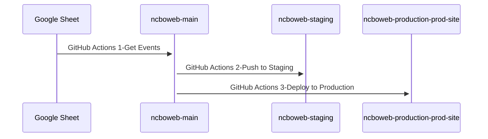

# NCBOWEB

Code repo and test/staging environment for GitHub Pages website

## URLs

[https://test.ncbaroqueorchestra.org](https://test.ncbaroqueorchestra.org)
[https://www.ncbaroqueorchestra.org](https://www.ncbaroqueorchestra.org)

## Branches

| Repo | Branch | Purpose |
| ---- | ------ | ------- |
| ncboweb | main | main code repo |
| ncboweb | staging | GitHub Pages source for test.ncbaroqueorchestra.org |
| ncboweb-production | main | not used |
| ncboweb-production | prod-site | GitHub Pages source for www.ncbaroqueorchestra.org |

## Code

The site is a SPA (single page app) static app using a [Bootstrap template](README-Bootstrap.md) and Jekyll as build engine. Code is primarily in _layouts/home.html

First time setup, run:

        `bundle install`

If errors, carefully follow instructions on installing jekyll (ex: https://jekyllrb.com/docs/installation/ubuntu/)

To test site locally run:

        `bundle exec jekyll serve --baseurl=""`

To run jekyll on a server and host, run:

        `bundle exec jekyll serve --baseurl="" --host 0.0.0.0`

## Refresh Events Script

Events are maintained in AirTable. There is a script `refresh_event_data.py` that runs in GitHub Actions to pull new event data into the site. Once events are loaded, the site must be published to staging and the production...again with GitHub Actions.

## DevOps

Site publishing is handled through GitHub Actions. Once code is committed to ncboweb (main branch), GitHub Actions automatically runs (2-Push to Staging) and pushes code to staging branch where it is accessible through https://test.ncbaroqueorchestra.org.

If everything checks out after a manual inspection of the test site, the Action (3-Deploy to Production) is manually activated which pushes from main to ncboweb-production/prod-site repo and branch.

### Sequence Diagram

## Google Sheet (Events and Notices Info)

Donor names are retrieved from a [publicly published](https://support.google.com/docs/answer/183965?hl=en&co=GENIE.Platform%3DDesktop#:~:text=%20Publish%20file%20%201%20In%20Google%20Docs%2C,quickly%20to%20advanc...%206%20Click%20Publish.%20More%20) Google Sheet. A GitHub action retrieves the data from each of the tabs on the sheet that are formatted for Markdown and stores it in associated files (_data/events.yml & _data/notices.yml). This action is run manually anytime spreadsheet data changes.

[Google Sheet](https://docs.google.com/spreadsheets/d/1s8rtxz4RuO8eknorelIU73sraxMn-AJCx_JjsBq4ZOs/edit#gid=1551757575)

## Troubleshooting

If receiving 404 error when accessing either www.* or test.* sites after deployment, chances are that the CNAME file is not correct.

1. Make sure that there is no CNAME file in the ncboweb/main repo.
2. Make sure that the CNAME file in ncboweb/staging is set to 'test.ncbaroqueorchestra.org' and ncboweb-production/prod-site is set to 'www.ncbaroqueorchestra.org'
