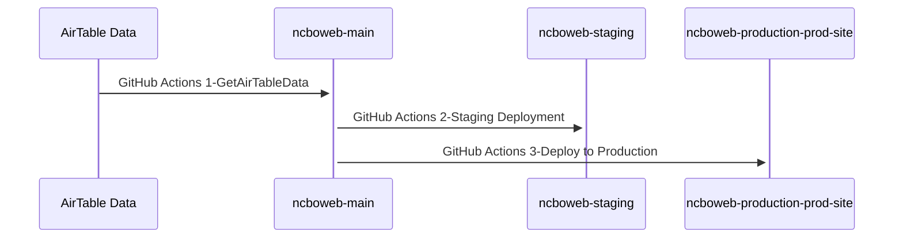

# NCBOWEB

Code repository and test/staging environment for the North Carolina Baroque Orchestra (NCBO) website.

This project manages the workflow for the static website, integrating dynamic event and donor information from AirTable, and features automated backups and deployments using GitHub Actions.

## System Overview

The NCBO website relies on several interconnected systems to manage content, backups, and deployments:

### 1. **AirTable**
- **Purpose:** Source of truth for Events, Donors, and Board Members data.
- **Role:** Staff and volunteers update information here, which is then published on the website.

### 2. **Val Town**
- **Purpose:** Provides automated daily backups of all data from AirTable.
- **Role:** Ensures data safety by retaining backups for 30 days.
- **Backup Process:** [Val Town Backup Script](https://www.val.town/x/srhall/backupNCBOAirTableData)

### 3. **GitHub Repositories**
- **ncboweb:** Main code repository for development and staging.
    - `main` branch: ongoing development
    - `staging` branch: source for the test site
- **ncboweb-production:** Separate repository for the production build.
    - `prod-site` branch: source for the live website

### 4. **GitHub Actions**
- **Purpose:** Automates data refresh from AirTable and deployment to both test and production websites.
    - 1. **GetAirTableData:** Fetches latest data from AirTable.
    - 2. **Staging Deployment:** Publishes changes to the test site.
    - 3. **Deploy to Production:** Publishes approved changes to the live site.

### 5. **Websites**
- **Test Site:** [test.ncbaroqueorchestra.org](https://test.ncbaroqueorchestra.org)
    - Used to preview all changes before going live.
- **Production Site:** [www.ncbaroqueorchestra.org](https://www.ncbaroqueorchestra.org)
    - The official, public-facing site.

---

**Information Flow:**
1. Data is managed in AirTable.
2. Val Town backs up AirTable data daily.
3. Website code and data are updated via GitHub repositories.
4. GitHub Actions automate data pulls and site deployments:
    - Changes are first published to the test site for review.
    - Upon approval, changes are pushed to the production site.

---

## URLs

- **Test / Staging:** [https://test.ncbaroqueorchestra.org](https://test.ncbaroqueorchestra.org)
- **Production:** [https://www.ncbaroqueorchestra.org](https://www.ncbaroqueorchestra.org)

---

## Data Sources & Backups

- **Primary Data:** [AirTable](https://airtable.com/)
  - Stores Events, Donors, Board Members.
- **Backup:** [Val Town](https://www.val.town/x/srhall/backupNCBOAirTableData)
  - Automated daily backup of AirTable data (retains for 30 days).

---

## Branches & Repositories

| Repo                       | Branch      | Purpose                                         |
|----------------------------|-------------|-------------------------------------------------|
| ncboweb                    | main        | Main development code repo                      |
| ncboweb                    | staging     | GitHub Pages source for test site               |
| ncboweb-production         | main        | Not used                                        |
| ncboweb-production         | prod-site   | GitHub Pages source for production site         |

---

## Website Technology

- **Static Single Page Application (SPA)**
- **Bootstrap Template** (see [README-Bootstrap.md](README-Bootstrap.md))
- **Jekyll** used as the build engine
- Primary code: `_layouts/home.html`

### Setup & Local Development

Install dependencies (first time):

    bundle install

If errors occur, follow Jekyll install docs: [Jekyll Installation](https://jekyllrb.com/docs/installation/ubuntu/)

Serve locally:

    bundle exec jekyll serve --baseurl=""

To serve on all interfaces (for remote access):

    bundle exec jekyll serve --baseurl="" --host 0.0.0.0

---

## Data Refresh & Automation

- **Events, Donors, Board Members** are managed in AirTable.
- GitHub Actions run the script `refresh_event_data.py` to fetch the latest AirTable data and update the site.
- **Automated Backups:**
  - [Val Town backup process](https://www.val.town/x/srhall/backupNCBOAirTableData) runs daily.

---

## DevOps: Staging & Production Workflow

Website publishing and data refreshes are automated using **GitHub Actions**:

1. **GetAirTableData:**
   - Automatically pulls latest data from AirTable.
2. **Staging Deployment:**
   - Code/data changes are deployed to the `staging` branch and published at [test.ncbaroqueorchestra.org](https://test.ncbaroqueorchestra.org).
3. **Production Deployment:**
   - After manual review, the deployment to production (`prod-site` branch in `ncboweb-production` repo) is triggered for the live site.

### Sequence Diagram

---

## Troubleshooting

**404 Errors on Deployment:**
If you encounter 404 errors accessing either the production or test site after deployment, it is likely due to an incorrect CNAME file.

- Ensure **NO CNAME file** in the `ncboweb/main` branch.
- The `staging` branch in `ncboweb` should have a CNAME file set to:
  `test.ncbaroqueorchestra.org`
- The `prod-site` branch in `ncboweb-production` should have a CNAME file set to:
  `www.ncbaroqueorchestra.org`

---

## Additional Notes

- Data in AirTable is automatically backed up daily via [Val Town](https://www.val.town/x/srhall/backupNCBOAirTableData), with backups retained for 30 days.
- All content and code updates flow through test/staging before being deployed to the live site.
- **Manual approval is required** before promoting changes to production.
